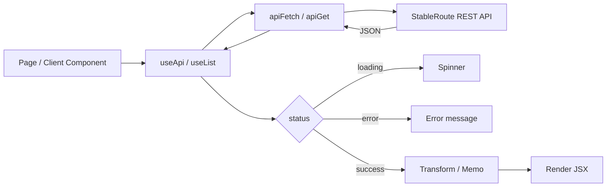

# Frontend data-flow architecture

## Overview

The StableRoute frontend is a Next.js (App Router) single-page application
that communicates with a REST API. This document describes how data flows
from the API to the rendered UI.

## Request-to-render flow

## API client

**Source:** `src/lib/apiClient.ts`

The `apiFetch<T>` function is the single entry point for all HTTP requests.
It wraps `fetch()` with:

- **Automatic base URL** – prepends `getApiBase()` (from `src/lib/config.ts`,
  default `http://localhost:3001`) to every path.
- **Timeout** – aborts the request after 15 s (configurable via
  `ApiFetchOptions.timeoutMs`).
- **Retry** – for idempotent GET/HEAD methods, retries up to 3 times with
  exponential backoff on 5xx errors and network failures.
- **Error handling** – non-OK responses throw an `Error` with a sanitized
  message (secrets and query strings are redacted by `sanitizeErrorMessage`).
   `401`/`403` statuses additionally fire the registered auth-error handler
  (see `ApiAuthGuard` below).
- **Reachability callbacks** – every request that reaches the server fires
  `_connectionHandler.onSuccess()`; network-level failures fire
  `_connectionHandler.onError()` (see `ConnectionBanner` below).

Convenience wrappers: `apiGet`, `apiPost`, `apiPatch`, `apiDelete`.

### Auth-error handler

**Components:** `src/components/ApiAuthGuard.tsx`, `src/app/layout.tsx:49`

`ApiAuthGuard` (rendered once in the root layout) calls
`registerAuthErrorHandler` and shows an error toast on any 401/403.

### Connection banner

**Component:** `src/components/ConnectionBanner.tsx`

`ConnectionBanner` observes reachability through `registerConnectionHandler`.
After two consecutive network failures it shows an amber banner; a single
success dismisses it.

## Fetch-state model

Two hooks model the async lifecycle of every remote data request:

### `useApi<T>(path)`

**Source:** `src/lib/useApi.ts`

| Status   | Available fields         |
|----------|--------------------------|
| `idle`   | `refetch`                |
| `loading`| `refetch`                |
| `error`  | `error`, `refetch`       |
| `success`| `data`, `refetch`        |

- Accepts a URL path string or `null` (when `null` the status is `idle`).
- Re-fetches automatically when the path changes.
- Call `refetch()` to force a reload.

### `useList<T>(loader)`

**Source:** `src/lib/useList.ts`

Same lifecycle as `useApi` but accepts an async `loader` function instead of
a URL. Used by CRUD pages (api-keys, webhooks) that must call the API and
then unwrap a nested `items` array. Guarantees the latest request wins via an
incrementing `requestIdRef`.

## Data flows by feature

### Pairs

| Step | Module / Component | What happens |
|------|-------------------|--------------|
| 1 | `src/app/pairs/page.tsx` | Server component; exports metadata, renders `PairsClient`. |
| 2 | `src/app/pairs/Client.tsx` | Calls `useApi<{ pairs: Pair[] }>('/api/v1/pairs')` on mount. |
| 3 | `src/lib/useApi.ts` | Fires `apiGet`, manages `loading` / `error` / `success` state. |
| 4 | `src/lib/apiClient.ts` | Sends GET to `<api-base>/api/v1/pairs` with timeout & retry. |
| 5 | `src/lib/types.ts` | Response parsed as `{ pairs: Pair[] }` (each pair: `{ source, destination }`). |
| 6 | `src/app/pairs/Client.tsx` | Extracts `api.data.pairs`; passes through `filterPairs` + `groupBySource` (both from `src/lib/pairsTransforms.ts`). |
| 7 | `src/lib/pairsTransforms.ts` | `filterPairs` – case-insensitive substring match on source/destination. `groupBySource` – produces `[source, destinations[]]` tuples, sorted. |
| 8 | `src/app/pairs/Client.tsx` | Renders grouped list with copy, delete, and link-to-quote actions. |
| 9 | Delete action | Calls `apiDelete` then `api.refetch()` to re-sync. |

### Stats

| Step | Module / Component | What happens |
|------|-------------------|--------------|
| 1 | `src/app/stats/page.tsx` | Server component; exports metadata, renders `StatsClient`. |
| 2 | `src/app/stats/Client.tsx` | Calls `useApi<Stats>('/api/v1/stats')` where `Stats = { totalPairs, paused }`. |
| 3 | `src/lib/useApi.ts` | Fires `apiGet`, manages lifecycle states. |
| 4 | `src/app/stats/Client.tsx` | On success, applies `formatNumber` (from `src/lib/format.ts`) for display. |
| 5 | Polling | A 5-second `setInterval(refetch, 5000)` keeps metrics fresh. |
| 6 | Export | `buildStatsSnapshot` → `statsSnapshotToJson` / `statsSnapshotToCsv` → `triggerDownload`. All pure functions in `Client.tsx`. |

### Quote

| Step | Module / Component | What happens |
|------|-------------------|--------------|
| 1 | `src/app/quote/Client.tsx` | Form collects `sourceAsset`, `destAsset`, `amount`. |
| 2 | Validation | Client-side validation in `Client.tsx` (asset code pattern, positive integer amount). |
| 3 | Request | Calls `apiFetch<Quote>(path)` with query params `?source_asset=...&dest_asset=...&amount=...`. Aborts previous in-flight request via `AbortController`. |
| 4 | `src/lib/apiClient.ts` | Sends GET, parses `Quote` response. |
| 5 | Display | Formats amount via `formatQuoteAmountDisplay` / `formatQuoteRateDisplay` (both from `src/lib/format.ts`). |
| 6 | History | Inputs persisted to `localStorage` via `useLocalStorage` (`src/lib/useLocalStorage.ts`). |

### Events

| Step | Module / Component | What happens |
|------|-------------------|--------------|
| 1 | `src/app/events/Client.tsx` | Calls `useApi<unknown>('/api/v1/events?limit=100')`. |
| 2 | Parse | Raw response is passed through `parseEventsResponse` from `src/lib/events.ts`. Invalid/malformed records are dropped. Payloads are safe-stringified (circular refs → `"[Circular]"`, truncation at 4000 chars). |
| 3 | Filter | Client-side type filter (case-insensitive substring). |
| 4 | Export | `buildEventsCsv` from `src/lib/events.ts` → `downloadCsv`. |

### API keys & Webhooks

Both follow the same CRUD pattern:

1. `useList<T>(loader)` fetches `{ items: T[] }`.
2. Create/mutate calls go through `apiPost` / `apiDelete`.
3. After mutation, `refetch()` is called to re-sync the list.

## Transforms

Transforms are pure functions that derive display-ready data from API
responses. They live in:

| File | Purpose |
|------|---------|
| `src/lib/pairsTransforms.ts` | `filterPairs`, `groupBySource` |
| `src/lib/format.ts` | `formatStroops`, `formatNumber`, `formatQuoteAmountDisplay`, `formatQuoteRateDisplay`, `formatTime`, `formatTimestamp` |
| `src/lib/events.ts` | `parseEventsResponse`, `buildEventsCsv`, `safeStringifyPayload` |
| `src/lib/quote.ts` | `normalizeAsset`, `isValidAmount` |
| `src/lib/clipboard.ts` | `writeToClipboard` |

All transforms are tested at `src/lib/__tests__/`.

## Relation to existing docs

Additional detail for specific subsystems can be found in:

- `docs/api-client.md` – API client internals and error handling
- `docs/hooks.md` – `useApi` / `useList` contract
- `docs/events-validation.md` – Event payload validation
- `docs/quote-validation.md` – Quote input validation
- `docs/stats-export.md` – Stats snapshot export formats
- `docs/status-page.md` – Status page health check flow
