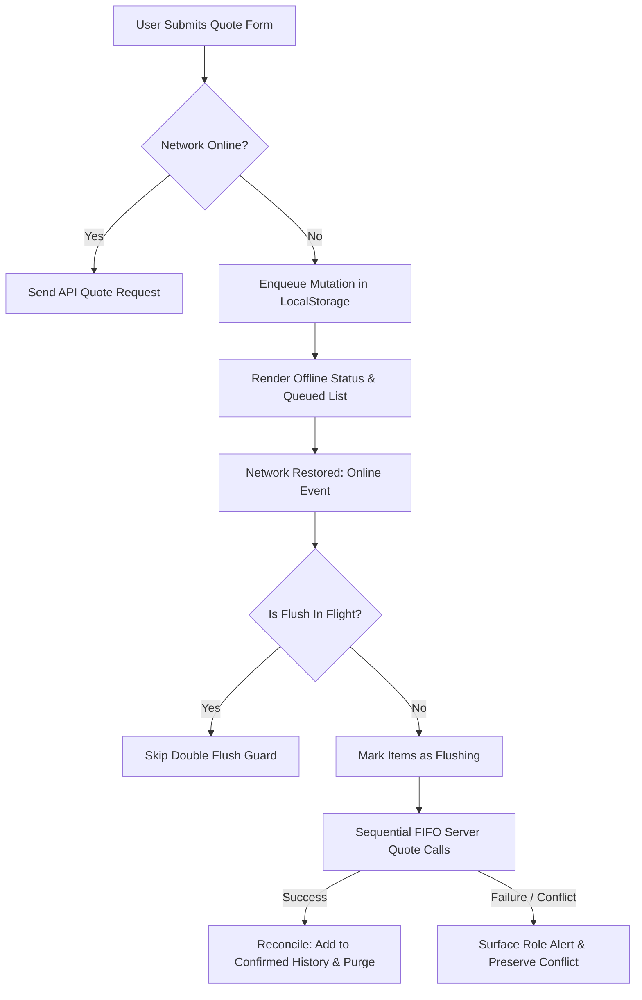

# Offline Detection with Queued Swap Mutations and Reconcile (#729)

## Overview
When a network connection drops or fluctuates, swap interface mutations can fail silently or lead to lost user input. This feature adds robust offline detection, persistent client-side queuing, automatic sequential flush upon reconnection, and state reconciliation with server responses.

## Architecture & Data Flow

### 1. Offline Detection
- Monitored using `window.addEventListener('online')` and `window.addEventListener('offline')` along with `navigator.onLine`.
- Network changes trigger an accessible live region banner (`role="status"` and `aria-live="polite"`).

### 2. Mutation Queuing & Idempotency
- Implemented in `src/app/quote/offlineQueueModel.ts` and managed via `useOfflineQueue`.
- Each mutation contains:
  - `id`: Unique RFC-compliant random identifier.
  - `source`: Normalized uppercase source asset code.
  - `dest`: Normalized uppercase destination asset code.
  - `amount`: Trimmed base unit integer.
  - `timestamp`: Chronological creation timestamp.
  - `status`: `'queued' | 'flushing' | 'reconciled' | 'conflict'`.
  - `conflictReason`: String message detailing server rejection reason.
- Idempotency & Deduplication: Submitting an identical mutation (same source, dest, amount) while in `'queued'` status re-uses the existing pending queue item without duplication.
- Storage Persistence: Persisted under `localStorage` key `stableroute.quote.offline_queue` to survive browser refreshes.

### 3. Flush & Reconcile Protocol
- On reconnection (`online` event), `flushQueue` is triggered automatically.
- **Double-apply Guard:** `isFlushingRef` and `flushingIdsRef` guarantee that repeated reconnect events or rapid manual triggers never double-apply or replay mutations.
- Flushes in strict FIFO order according to mutation timestamp.
- Successful responses are converted into canonical history entries (`canonicalEntryFromQuote`) and added to confirmed recent quotes, then purged from the offline queue.
- Reconcile failures (e.g. liquidity depletion, slippage exceedance, 4xx/5xx HTTP responses) transition to `'conflict'` status, surface immediately as a `role="alert"` notification, and allow user dismissal or retry.

## Edge Cases Covered & Verified
- **Go offline -> mutation queued, UI reflects offline:** Form submits cleanly without network errors, updates the queue count, and renders the offline indicator.
- **Reconnect -> queue flushes in order:** On reconnect, pending items execute strictly in FIFO order, updating the backend and recent quotes table.
- **Reload while offline -> queue persists:** Items written to localStorage are rehydrated on initial mount even across browser reloads.
- **Flush twice -> no double-apply:** Concurrent flushes or duplicate reconnect triggers are blocked by the flush guard.
- **Server conflict -> surfaced:** Backend rejection reasons are preserved and displayed clearly with interactive dismissal.
